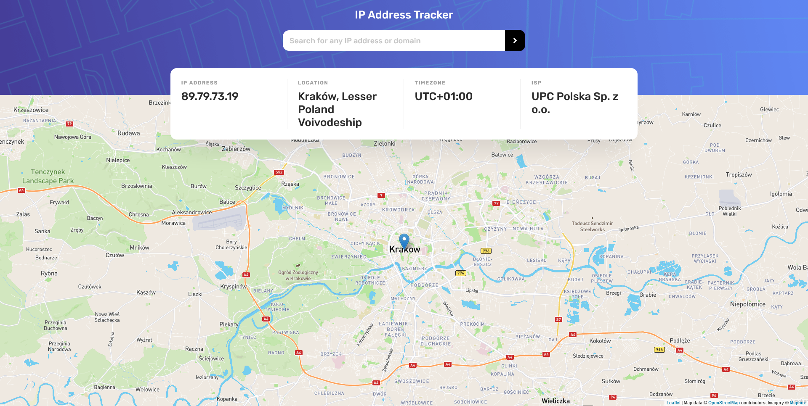

# Frontend Mentor - IP address tracker solution

This is a solution to the [IP address tracker challenge on Frontend Mentor](https://www.frontendmentor.io/challenges/ip-address-tracker-I8-0yYAH0). Frontend Mentor challenges help you improve your coding skills by building realistic projects.

You can check Live Site URL [here](https://ip-address-tracker-mbart13.vercel.app)

## Table of contents

- [Overview](#overview)
  - [The challenge](#the-challenge)
  - [Screenshot](#screenshot)
  - [Links](#links)
- [My process](#my-process)
  - [Built with](#built-with)

## Overview

### The challenge

Users should be able to:

- View the optimal layout for each page depending on their device's screen size
- See hover states for all interactive elements on the page
- See their own IP address on the map on the initial page load
- Search for any IP addresses or domains and see the key information and location

### Screenshot

## My process

### Built with

- React with Context API and hooks
- Geolocation API by IPify
- LeafletJS for generating map
- flexbox
- Sass
- Mobile-first workflow

In this project I tried to organize folder structure a little better, but still I'm not sure if this is correct as there are so many approaches in react projects.
Initially I wanted to use react-leaflet library for map generation, but it didn't work as I expected, so next time it would be better to read documentation first.
